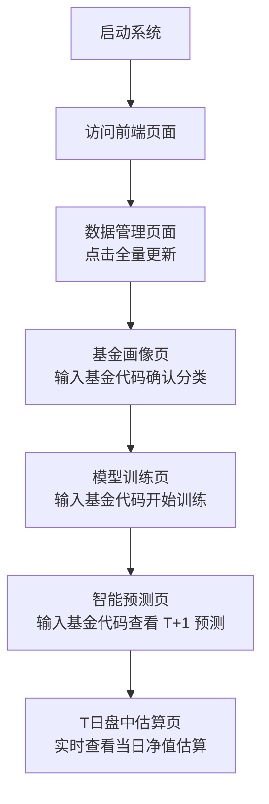

# 基金净值预测系统

基于 FastAPI + Vue3 的基金净值预测系统，支持 T+1 净值预测、T 日盘中估算、模型训练、回测诊断、AI 解读等功能。

## 技术栈

| 层 | 技术 | 版本 |
|---|---|---|
| 后端框架 | FastAPI (异步) | 0.115+ |
| 数据库 | SQLite (WAL 模式) | 内置 |
| ORM | SQLAlchemy | 2.0+ |
| 数据获取 | AKShare | 最新 |
| 机器学习 | scikit-learn + LightGBM + XGBoost | 最新 |
| 任务调度 | APScheduler | 3.10+ |
| 前端框架 | Vue 3 (Composition API) | 3.4+ |
| 构建工具 | Vite | 5.x |
| UI 组件库 | Element Plus | 2.x |
| 图表 | ECharts | 5.x |
| AI Provider | 智谱 GLM + 硅基流动 | OpenAI 兼容 |

## 前置条件

- Python 3.11+
- Node.js 20+
- npm 10+
- Docker (可选，容器化部署)

## 快速开始（开发模式）

### 1. 克隆并安装后端依赖

```bash
cd /home/joakim/Project/fund_project
pip install -r requirements.txt
```

### 2. 配置环境变量

```bash
cp .env.example .env
```

编辑 `.env` 文件，填入 API Key（如果不需要 AI 分析功能，可以保留占位符）：

| 变量 | 说明 | 获取地址 |
|---|---|---|
| `GLM_API_KEY` | 智谱 GLM API Key | https://open.bigmodel.cn/usercenter/apikeys |
| `SILICONFLOW_API_KEY` | 硅基流动 API Key | https://cloud.siliconflow.cn/account/ak |

### 3. 安装前端依赖

```bash
cd frontend
npm install
cd ..
```

### 4. 启动后端服务

```bash
cd backend
uvicorn app.main:app --host 0.0.0.0 --port 8000 --reload
```

后端将在 http://localhost:8000 启动，API 文档地址：
- Swagger UI: http://localhost:8000/docs
- ReDoc: http://localhost:8000/redoc
- 健康检查: http://localhost:8000/health

### 5. 启动前端服务（新终端）

```bash
cd frontend
npm run dev
```

前端将在 http://localhost:3000 启动，API 请求会自动代理到后端 8000 端口。

### 6. 一键启动（开发模式）

```bash
chmod +x start.sh
./start.sh dev
```

## Docker 部署

### 构建并启动

```bash
./start.sh docker
```

或手动执行：

```bash
docker-compose up --build
```

- 后端: http://localhost:8000
- 前端: http://localhost:80

### 目录挂载说明

Docker 容器会自动挂载以下目录：

| 宿主机路径 | 容器内路径 | 用途 |
|---|---|---|
| `./config.yaml` | `/app/config.yaml` | 全局配置 |
| `./data/` | `/app/data/` | 数据库和原始数据 |
| `./models/` | `/app/models/` | 训练好的模型文件 |
| `./logs/` | `/app/logs/` | 日志文件 |

## 项目结构

```
fund_project/
├── config.yaml                # 全局配置
├── .env                       # 环境变量（不提交 git）
├── .env.example               # 环境变量模板
├── requirements.txt           # Python 依赖
├── docker-compose.yml         # Docker 编排
├── start.sh                   # 启动脚本
│
├── backend/
│   ├── Dockerfile
│   └── app/
│       ├── main.py            # FastAPI 入口
│       ├── core/              # 核心模块（配置/数据库/异常/日志/中间件/调度）
│       ├── api/               # 路由层（薄层，参数校验 + 调用 service）
│       ├── schemas/           # Pydantic 请求/响应模型
│       ├── models/            # SQLAlchemy ORM 模型
│       └── services/          # 业务逻辑层
│           ├── data/          # 数据获取（AKShare + 新浪实时行情）
│           ├── fund/          # 基金画像和分类路由
│           ├── features/      # 特征工程（技术面/基准/宏观/日历）
│           ├── model/         # 模型训练和版本管理
│           ├── predict/       # T+1 预测和盘中估算
│           ├── ai/            # AI 分析（GLM + SiliconFlow）
│           └── task/          # 异步训练任务和定时更新
│
├── frontend/
│   ├── Dockerfile
│   ├── nginx.conf             # 生产环境 nginx 配置
│   ├── index.html
│   ├── vite.config.js
│   ├── package.json
│   └── src/
│       ├── main.js            # Vue 应用入口
│       ├── App.vue
│       ├── router/            # 路由配置（9 个页面）
│       ├── stores/            # Pinia 状态管理
│       ├── api/               # Axios 请求封装
│       ├── views/             # 页面组件
│       ├── components/        # 通用组件
│       ├── utils/             # 工具函数
│       └── styles/            # 全局样式
│
├── data/                      # 数据库和原始数据（不提交 git）
│   ├── raw/
│   │   ├── fund_nav/          # 基金净值 CSV 备份
│   │   ├── holdings/          # 持仓数据 CSV
│   │   └── index/             # 指数数据 CSV
│   └── processed/             # 特征工程后的数据集
│
├── models/                    # 训练好的模型（不提交 git）
├── logs/                      # 日志文件（不提交 git）
├── docs/                      # 技术文档
└── trash/                     # 废弃文件
```

## API 接口一览

所有接口统一返回格式：`{"ok": true, "data": {...}}` 或 `{"ok": false, "error": {"code": "...", "message": "..."}}`

| 方法 | 路径 | 说明 |
|---|---|---|
| POST | `/api/v1/fund/predict` | T+1 净值预测 |
| GET | `/api/v1/fund/search?q=` | 基金名称/代码搜索 |
| POST | `/api/v1/fund/validate` | 基金代码验证与标准化 |
| GET | `/api/v1/fund/{code}/profile` | 基金完整画像 |
| GET | `/api/v1/fund/{code}/news` | 基金相关新闻 |
| POST | `/api/v1/fund/batch-predict` | 批量预测（最多 10 只） |
| GET | `/api/v1/fund/{code}/backtest?days=90` | 回测历史预测准确率 |
| POST | `/api/v1/fund/{code}/rollback` | 模型版本回滚 |
| POST | `/api/v1/train` | 创建训练任务 |
| GET | `/api/v1/tasks/{task_id}` | 查询训练任务状态 |
| GET | `/api/v1/tasks?fund_code=&limit=&offset=` | 训练任务列表 |
| POST | `/api/v1/intraday/{code}` | T 日盘中净值估算 |
| POST | `/api/v1/ai/analysis` | AI 分析报告 |
| GET | `/api/v1/ai/provider-status` | AI Provider 可用性检测 |
| GET | `/api/v1/dashboard/stats` | 首页统计 |
| GET | `/api/v1/dashboard/recent-predictions` | 最近预测记录 |
| GET | `/api/v1/admin/data-status` | 数据新鲜度状态 |
| POST | `/api/v1/admin/update-data` | 手动触发数据更新 |

## 首次使用流程



## 配置说明

主要配置集中在 `config.yaml` 中，包括：

- **数据源**: AKShare 接口参数、缓存 TTL、重试策略
- **特征工程**: 滞后天数、滚动窗口、因子筛选阈值
- **模型训练**: Walk-Forward CV 参数、候选模型、样本权重
- **保形预测**: 置信区间参数（默认 90%）
- **净值约束**: 各类型基金日涨跌幅上限
- **AI 分析**: GLM + SiliconFlow 并发路由、Prompt 模板
- **定时调度**: 每日 17:30 净值更新、21:30 回填预测误差

## 系统功能

- **T+1 净值预测**: 收盘后预测下一交易日基金净值涨跌幅及 90% 置信区间
- **T 日盘中估算**: 交易时段内基于持仓映射实时估算当日净值
- **模型训练**: 为指定基金训练专属预测模型（异步任务，含 Walk-Forward CV）
- **回测诊断**: 查看历史预测的准确率、MAE、方向命中率、区间覆盖率
- **基金画像**: 展示基金基本信息、类型、持仓、风险特征
- **多基金对比**: 同时展示多只基金的预测结果
- **AI 解读**: 调用 GLM/SiliconFlow 生成自然语言分析报告
- **新闻聚合**: 聚合财联社、东方财富等财经新闻
- **数据管理**: 查看数据新鲜度、手动触发更新